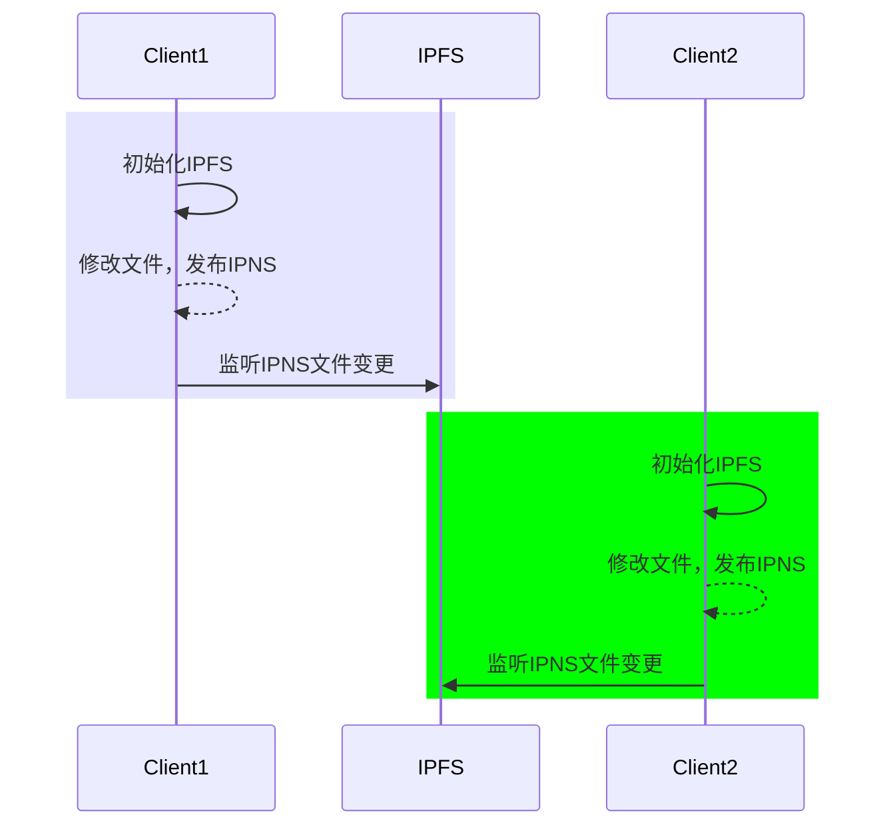

# 技术选型

## 方案

### 方案一（选定）

> IPFS + IPNS

1. 使用`IPFS`提供文件访问与存储的能力
2. 使用`IPNS`将文件映射成`IPNS地址`（这里解决如果文件变更，`HASH值`同步变更的问题） 

可能存在的问题：
1. 使用`IPNS`可能同步较慢，50秒至3分钟


### 方案二（不合适）

> `IPFS-Cluster` 

使用`IPFS-Cluuter`确实可以解决不同节点的数据同步问题，但是无法解决`HASH值变更的问题`，以及`获取文件信息`的问题


### 方案三（备选）

 > `lIbp2p`

使用`Libp2p`实现节点数据同步与访问。此种方式定制化能力强，开发量比较多，而且只能解决节点通信问题，数据的`存储`，`去重`, `冲突`等操作都需要自己完成

可能存在的问题：
1. 需要实现文件管理


## 交互流程图



## 私有IPFS节点发现加速优化

> IPFS网络是根据启动时的私钥决定的，只有私钥一致的节点才能进行通信（私钥并不是节点ID）

```mermaid
sequenceDiagram
	title:节点启动优化
    participant C1 as Client1
    participant CC as 云服务器
    participant C2 as Client2
    rect rgb(65, 170, 235)
    CC->>CC: 启动IPFS节点
    end
    rect rgba(0, 0, 255, .1)
    C1->>C1: 初始化IPFS
    C1->>CC: 连接已经启动的节点
    end
    rect rgb(0, 255, 0)
    C2->>C2: 初始化IPFS
    C2-->>C2: 连接已经启动的节点
    end
```

这一步不是必须的，但是理论上可以提高访问和同步速度，尤其是在私有网络的情况下